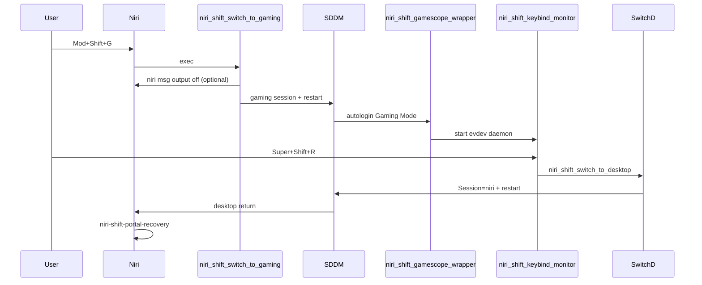

# NiriShift architecture

Audit of [DeckShift](https://github.com/28allday/deckshift) (v0.2.2, 2026) and how NiriShift reimplements the portable layers for Niri and other compositors.

## DeckShift component map

| Component | Path (DeckShift) | Portable? | NiriShift equivalent |
|-----------|------------------|-----------|----------------------|
| Installer | `deckshift.sh` (~140 KB monolith) | Partial | `install.sh` + `lib/` modules |
| Session wrapper | `/usr/local/bin/gamescope-session-nm-wrapper` | Yes (rebrand) | `niri-shift-gamescope-wrapper` |
| Enter gaming | `/usr/local/bin/switch-to-gaming` | Partial | `niri-shift-switch-to-gaming` |
| Exit gaming | `/usr/local/bin/switch-to-desktop` | Yes | `niri-shift-switch-to-desktop` |
| SDDM toggle | `/usr/local/bin/gaming-session-switch` | Partial | `niri-shift-gaming-session-switch` |
| Evdev monitor | `/usr/local/bin/gaming-keybind-monitor` | Yes | `niri-shift-keybind-monitor` |
| Portal fix | `/usr/local/bin/deckshift-portal-recovery` | Partial | `niri-shift-portal-recovery` |
| SDDM session | `gamescope-session-steam-nm.desktop` | Yes | Same name, our wrapper Exec |
| Steam exit | `/usr/lib/os-session-select` | Yes | Installed by NiriShift |
| SDDM config | `/etc/sddm.conf.d/zz-gaming-session.conf` | Partial | `Session=niri` vs `hyprland-uwsm` |
| Settings UI | Omarchy QML plugin | No | `niri-shift-settings` (gum TUI) |
| gamescope patch | `--nested-refresh` fallback | Yes | `lib/patch-gamescope-session-plus.sh` |

## Hyprland / Omarchy → Niri mapping

| DeckShift (Hyprland/Omarchy) | NiriShift (Niri) | Notes |
|------------------------------|------------------|-------|
| `hyprctl keyword monitor "DP-2,disable"` | `niri msg output DP-2 off` | Runtime only; config reload restores |
| `validate_environment`: requires `hyprctl` | Requires `niri` + running session for output list | Install works from TTY |
| SDDM `Session=hyprland-uwsm` | `Session=niri` | From `/usr/share/wayland-sessions/niri.desktop` |
| `bindings.lua`: `o.bind("SUPER+SHIFT+S", ...)` | `keybinds.kdl`: `Mod+Shift+G { spawn-sh "niri-shift-switch-to-gaming"; }` | User picks bind; `S` often taken |
| `autostart.lua`: portal recovery | `autostarts.kdl`: `spawn-sh-at-startup "niri-shift-portal-recovery"` | Optional installer hook |
| Portal: wait `HYPRLAND_INSTANCE_SIGNATURE` | Wait `niri msg version` / `NIRI_SOCKET` | Generic poisoned-frontend check |
| Portal backends: hyprland + gtk | gnome/wlr/gtk (detect installed) | Restart frontend only |
| `omarchy-pkg-add` | `pacman` / `yay` | No Omarchy dependency |
| `omarchy-hw-nvidia-*` | Document manual NVIDIA setup | Optional `config.env` hints |
| State dir `~/.local/state/omarchy/nosignal.deckshift` | `~/.local/state/niri-shift/` | |
| Cache `~/.cache/deckshift/saved-state` | `~/.cache/niri-shift/saved-state` | |

## Session flow

## Compositor backend interface

Each file in `backends/*.sh` must define:

| Function | Purpose |
|----------|---------|
| `backend_id` | Short name (`niri`, `hyprland`) |
| `backend_desktop_sddm_session` | SDDM Session= value for desktop |
| `backend_validate` | Compositor-specific checks |
| `backend_pre_gaming_switch` | Disable extra outputs before SDDM restart |
| `backend_portal_wait` | Wait until compositor env is ready after login |
| `backend_portal_backends` | Space-separated systemd units to stop before portal restart |
| `backend_keybind_doc` | Human-readable keybind instructions |

## License note

DeckShift does not declare a SPDX license on GitHub. NiriShift is an independent reimplementation of the portable session-switching pattern, informed by ChimeraOS `gamescope-session` (upstream) and DeckShift's public README/NOTES. Do not copy `deckshift.sh` wholesale into this repo.

## Dependencies

- Arch Linux (or derivative with pacman)
- SDDM with autologin or manual session select
- AUR: `gamescope-session-git`, `gamescope-session-steam-git`
- pacman: steam, gamescope, gamemode, python-evdev, gum, jq
- User in `video` group (sudoers) and `input` group (evdev monitor)
